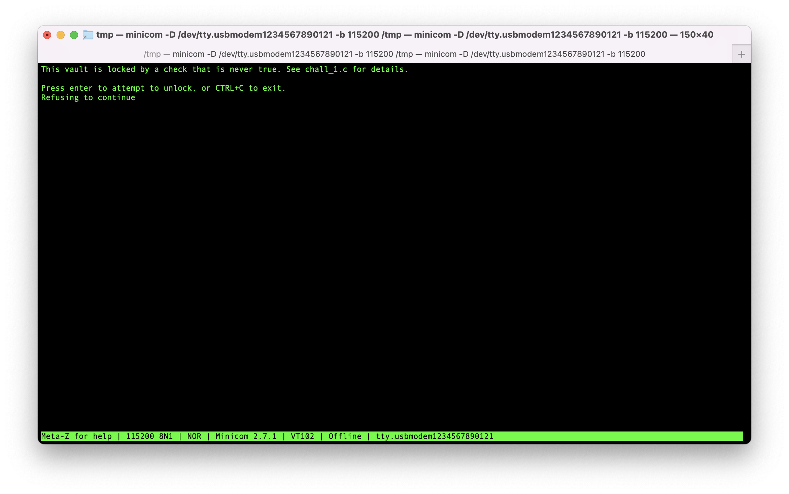
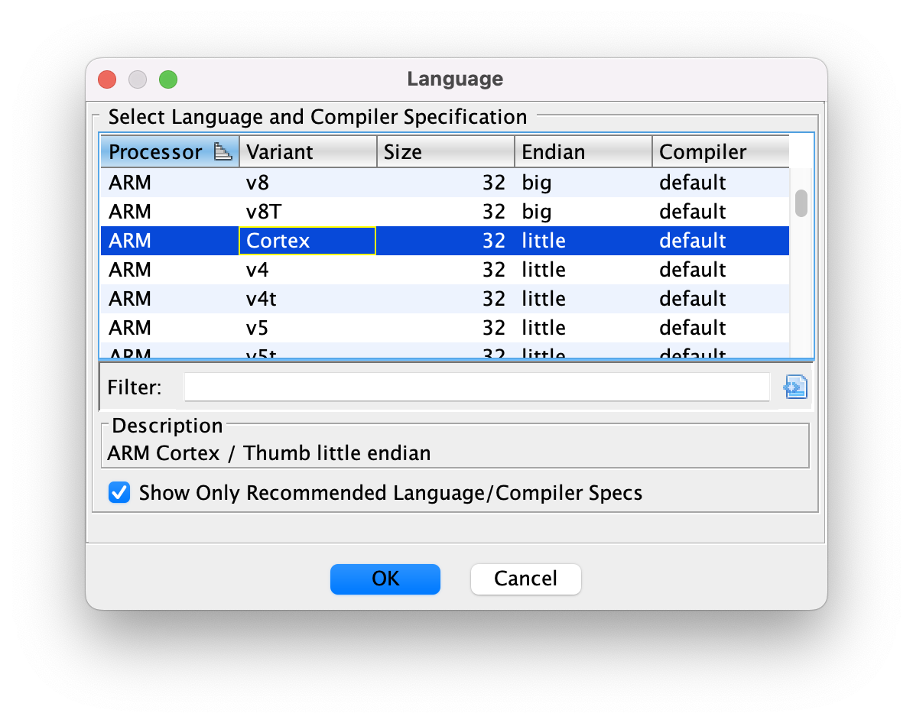
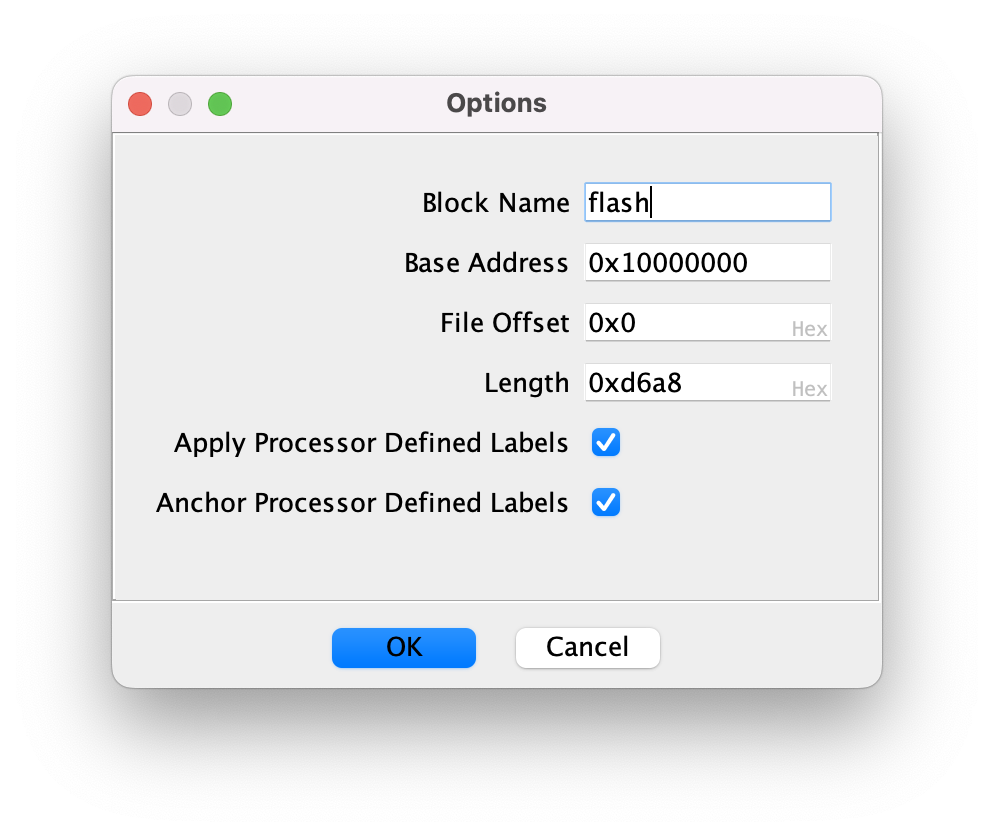
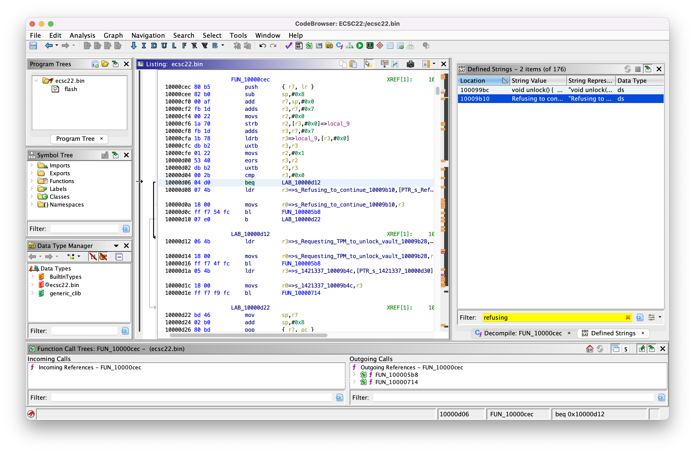
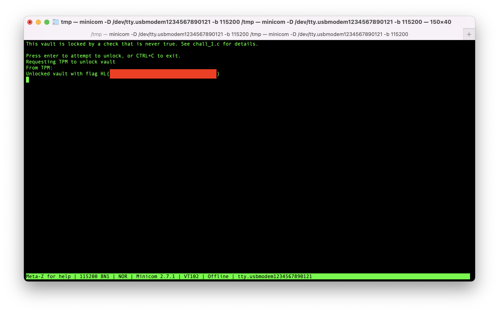

# Challenge 1

After opening a serial terminal via USB to the badge and selecting the first challenge, we are presented with a claim that the flag is locked by a function that refuses to unlock due to a check that is hardcoded to be false. Pressing enter in this screen shows that indeed the flag will not be shown.



------------

## Initial reconaissance: dumping firmware

The chip connected to the USB connector is an RP2040, as is hinted in the silkscreen printed on the badge. Searching the internet for this chip shows that it can be forced into a special bootloader mode by asserting its "BOOTSEL" pin during reset, which is handily exposed to a switch button on the badge.

This bootloader mode makes the RP2040 present itself as a mass storage device, allowing users to write new firmware to it by dragging a file. Additionally, in this mode Raspberry Pi's `picotool` command line utility can be used to dump the current firmware, too:

```bash
picotool save -a ecsc22.bin
```

------------

## Patching the hardcoded check

Reading through the datasheet for the RP2040, we see that the chip is a 32 bit Cortex M0+, with its flash storage peripheral mapped to memory at address 0x10000000.

We load the dumped image into Ghidra with the correct architecture, and the memory mapped address as the image base offset:




Next, searching for the "Refusing to unlock" string brings us to the offending check in the unlock function:



This conditional branch `be` can be patched in Ghidra to an unconditional jump `b`, and saved into a patched binary.

All that remains is to upload the patched firmware back onto the badge using picotool:

```bash
picotool load -f ecsc22_patched.bin
```

Now, when running challenge 1 again and pressing enter, we are greeted with the flag.

