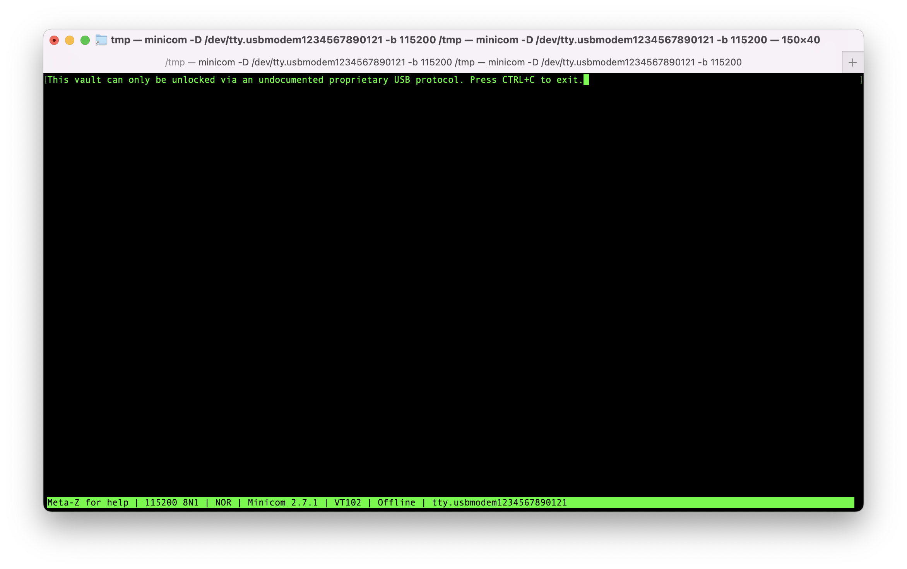
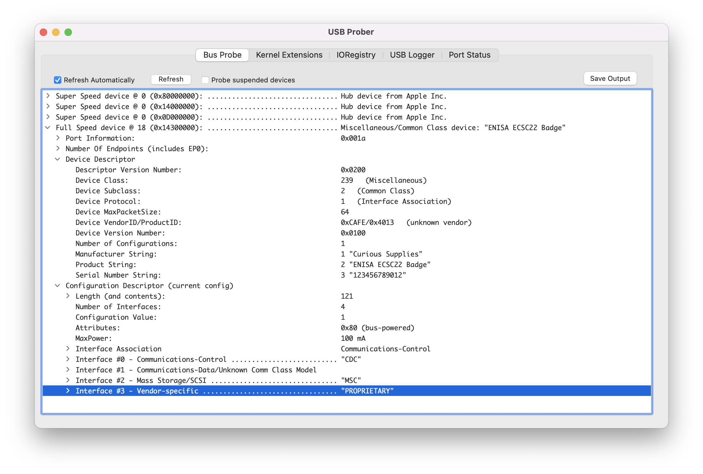
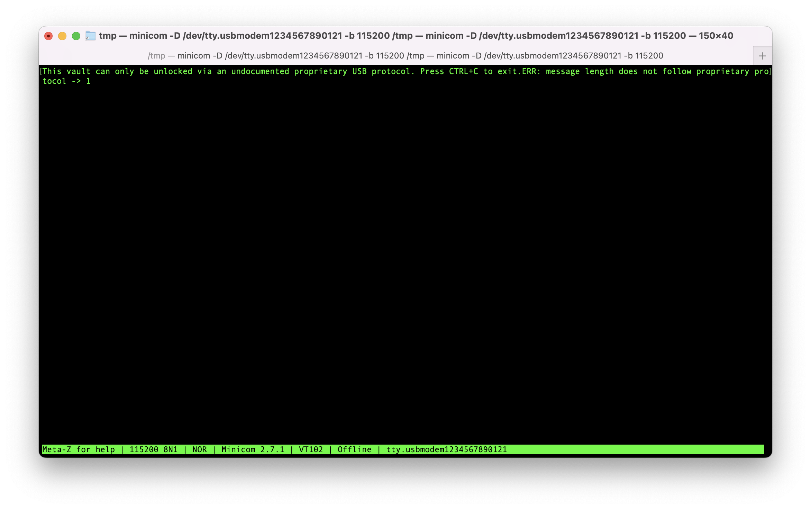

# Challenge 2

In this challenge, we are only shown a message that there is some sort of protection via a proprietary USB protocol:




------------

## Finding the right attack surface

Looking at the available USB interfaces of the badge (using e.g. `lsusb` on linux/unix, or USBProber on Mac), it can be seen that there are three interfaces:



The first two expose the badge as a serial adapter and mass storage device respectively, whereas the third one is a Vendor-class interface with a name that hints back to the word "proprietary" of the challenge description. Vendor-class USB interfaces are used by vendors to implement proprietary communication protocols with devices that normally require drivers from the vendor. It is this interface that we'll target.

------------

## Exploring the interface

USB communication happens via [endpoints](https://beyondlogic.org/usbnutshell/usb3.shtml#Endpoints), which can be seen as small buffers used to send or receive data. The vendor interface has one USB endpoint to read information from the host device (the OUT endpoint), and one to answer back to the host (the IN endpoint).

We can use e.g. `pyusb` to send something arbitrary to this interface to see what happens:

```python
import usb.core
dev = usb.core.find()
cfg = dev.get_active_configuration()
intf = cfg[(3,0)] # vendor interface
out_ep, in_ep = intf.endpoints()

out_ep.write(b"\xFF")
result = in_ep.read(1024)
print("Got:", result.tobytes())
```

On the serial port, we now see the badge complain that we sent an illegal command size to the vendor interface:



The same information is also read from the IN endpoint:

```bash
> python3 2.py 
Got: b'ERR: message length does not follow proprietary protocol\n'
```

This error keeps occurring for increasing payload sizes, until we send 4 bytes:

```python
import usb.core
dev = usb.core.find()
cfg = dev.get_active_configuration()
intf = cfg[(3,0)] # vendor interface
out_ep, in_ep = intf.endpoints()

out_ep.write(b"\xFF\xFF\xFF\xFF")
result = in_ep.read(1024)
print("Got:", result.tobytes())
```

The serial port is now completely silent, but a different error shows up on the IN endpoint:

```bash
> python3 2.py
Got: b'Unknown main command'
```

Ok, so the 4 bytes are apparently some command struct containing at least a main command, and likely more.


------------

## Uncovering the command structure

With the whole payload being 4 bytes, containing at least a main command and likely something else, it's reasonable to assume that this main command will not exceed more than half of the payload size. That means it's either 1 or 2 bytes. That's a feasible size to brute force. Cycling through values onthe most significant byte, we quickly get to a new error on value `0x06`:

```bash
> python3 solutions/2.py
Got: b'Unknown subcommand'
```

The main command is seemingly the first of the 4 bytes, and `0x06` is a valid main command. Another field is the `subcommand`, which is anywhere between 1-3 bytes in length. As the main command is 1 byte, it is reasonable that the subcommand might be the same length.

Freezing the first byte and cycling over the second results in a successfully unlocked vault on subcommand `0x8F`, indicating that the last 2 bytes are not necessary for the unlock command:


```bash
> python3 2.py
Got: b'Unlocked vault: HL{xxxxxxxxxxxxxxxxx}\r\n'
```