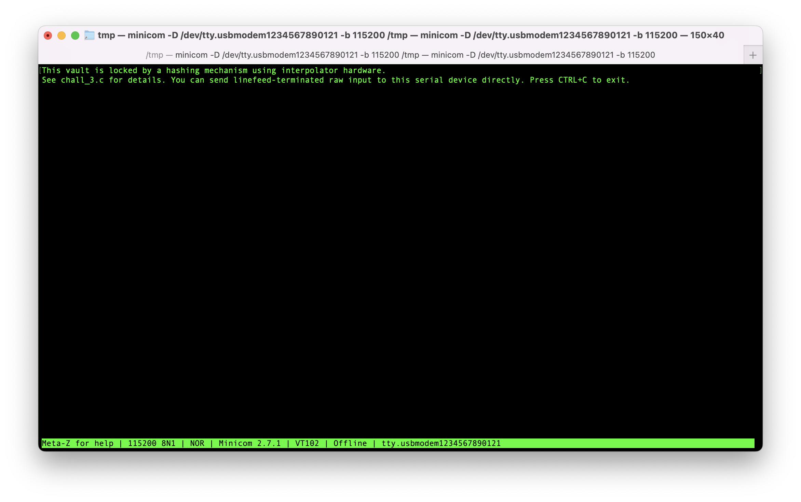

# Challenge 3

The third challenge presents us with some information on the serial port that says something about using `interpolator` hardware:



On mass storage, `chall_3.c` shows a lengthy implementation of a hashing scheme, using the [interpolator peripheral of the RP2040](https://datasheets.raspberrypi.com/rp2040/rp2040-datasheet.pdf):

```c
static char chall3_hash[] = {
    0xca, 0xec, 0x1d, 0x1a, 0xe7, 0x9d, 0x2c, 0x50,
    0x21, 0x5c, 0x17, 0x14, 0x74, 0x17, 0xe8, 0xd8,
    0xa3, 0x6c, 0x17, 0x8b, 0xb7, 0x83, 0xe6, 0xc0,
    0x01, 0x65, 0x06, 0xda, 0x95, 0x55, 0xd3, 0x26,
    0x10, 0x7a, 0x50, 0xac, 0x50, 0x58, 0xad, 0x0b,
    0x44, 0xa9, 0x25, 0xa4, 0x11, 0x58, 0x64, 0x21,
    0x7b, 0x5e, 0xb5, 0x6b, 0x6c, 0xa4, 0xfe, 0x66,
    0xc8, 0x10, 0x29, 0xff, 0x7d, 0x8f, 0x20, 0x1c 
};

void keygen(uint8_t * key) {
    interp_config cfg = interp_default_config();
    interp_set_config(interp0, 1, &cfg);
    interp_config_set_blend(&cfg, true);
    interp_set_config(interp0, 0, &cfg);

    interp0->base[0] = *((uint32_t *)0x61);
    interp0->base[1] = *((uint32_t *)0x61 + 1);

    for(int i = 0; i < 64; i++) {
        interp0->accum[1] = 255 * i / 64;
        uint32_t *div = (uint32_t *)&(interp0->peek[1]);
        uint8_t *b = (uint8_t*)(div);
        key[i] = b[0] + b[1] + b[2] + b[3];
    }
}

void interpolarize(io_rw_32 accum0, io_rw_32 base0, io_rw_32 accum1, io_rw_32 base1) {
    interp_config cfg = interp_default_config();
    interp_set_config(interp0, 0, &cfg);
    interp_set_config(interp0, 1, &cfg);
    
    interp_set_config(interp1, 0, &cfg);
    interp_set_config(interp1, 1, &cfg);
    
    interp0->accum[0] = accum0;
    interp0->base[0] = base0;
    interp0->accum[1] = accum1;
    interp0->base[1] = base1;

    for(int i = 0; i < 63; i++) {
        uint8_t *refa = (uint8_t*)(interp0->peek[0]);
        uint8_t *refb = (uint8_t*)(interp0->pop[1]);
        
        interp1->accum[0] = *refa;
        interp1->accum[1] = *refb;
        
        *refa = interp1->pop[2];
    }
}

void hash(uint8_t *key, const char *input, uint8_t *output) {
    int len = strlen(input);
    memcpy(output, input, 64);
    memset(&output[len], 64-len, 64-len);
    
    interpolarize((io_rw_32)(output-1), 1, (io_rw_32)(key-1), 1);    
    interpolarize((io_rw_32)output, 1, (io_rw_32)(output-1), 1);
    interpolarize((io_rw_32)(output+63), -1, (io_rw_32)(output+64), -1);
}

void chall3_handler(char *input, int len) {
    char key[64];
    char output[64];

    if (input[len-2] == CARRIAGE_RETURN) { 
        input[len-2] = '\0';
        len -= 2;
    } else if (input[len-1] == CARRIAGE_RETURN || input[len-1] == NEWLINE) {
        input[len-1] = '\0';
        len -= 1;
    }

    if (len <= 0 || len >= (64)) {
        uart_printf("Input needs to > 0 and < 64 characters\r\n");
        return;
    }

    keygen(key);
    hash(key, input, output);
       
    if (memcmp(output, chall3_hash, 64) == 0) {
        uart_printf("Winner winner\r\n");
    } else {
        uart_printf("Nope.\r\n");
     return;
    }

    // [..] successfully unlocked
}
```

Our goal here is to present the input that results in a match with the hardcoded hash, when passed through the `hash` function.


------------

## Getting the seed key

We firstly see that they `key` argument of `hash()` gets generated in `keygen()`. This function statically builds a key by running the interpolator hardware with its base registers set to 4-byte values from memory addresses 0x61 and 0x65. These addresses are in the bootrom, so let's dump the first 256 bytes of it:

```bash
> ./picotool save -r 0x00 0xFF -f bootrom_256.bin
Saving file: [==============================]  100%
Wrote 255 bytes to bootrom_256.bin

> xxd bootrom_256.bin 
00000000: 001f 0420 eb00 0000 3500 0000 3100 0000  ... ....5...1...
00000010: 4d75 0103 7a00 c400 1d00 0000 0023 0288  Mu..z........#..
00000020: 9a42 03d0 4388 0430 9142 f7d1 181c 7047  .B..C..0.B....pG
00000030: 30bf fde7 f446 00f0 05f8 a748 0021 0160  0....F.....H.!.`
00000040: 4160 e746 a548 0021 c943 0160 4160 7047  A`.F.H.!.C.`A`pG
00000050: ca9b 0d5b f91d 0000 2843 2920 3230 3230  ...[....(C) 2020
00000060: 2052 6173 7062 6572 7279 2050 6920 5472   Raspberry Pi Tr
00000070: 6164 696e 6720 4c74 6400 5033 0903 5233  ading Ltd.P3..R3
00000080: 2d03 4c33 5703 5433 8f03 4d53 b926 5334  -.L3W.T3..MS.&S4
00000090: ad26 4d43 1d26 4334 0526 5542 9125 4454  .&MC.&C4.&UB.%DT
000000a0: a901 4445 af01 5756 4501 4946 9124 4558  ..DE..WVE.IF.$EX
000000b0: e523 5245 6d23 5250 b523 4643 5123 4358  .#REm#RP.#FCQ#CX
000000c0: 2123 0000 4752 5000 4352 5800 5346 cc01  !#..GRP.CRX.SF..
000000d0: 5344 4c02 465a ca01 4653 3427 4645 282e  SDL.FZ..FS4'FE(.
000000e0: 4453 302e 4445 a43d 0000 7d48 0168 0029  DS0.DE.=..}H.h.)
000000f0: 28d1 fff7 9fff 7b49 0a68 530e 01d3 0a    (.....{I.hS....
```

`0x61` is where the Raspberry Pi company info from its copyright notice is stored it seems, making `base 0 = 0x70736152` and `base 1 = 0x72726562` (little-endian). Interpolator lanes 0 and 1 are activated, with 0 running in `blend mode`. Following the datasheet's description of blend mode operation, we have with `i from 0 to 64`, `key[i]` is the sum of the 4 bytes of `base0 + (255 / (i * 64))*(base1-base0)`. In code:

```python
def keygen():
    b0 = 0x70736152
    b1 = 0x72726562

    def bytesum(n):
        return sum( (n>>i)&0xff for i in (0,8,16,24) ) & 0xff

    return [ bytesum( ( b0 + (255*i//64)*(b1-b0)// 256 ) & 0xffffffff ) for i in range(64) ]
```


------------

## Reversing the hash algorithm

Now that we have the key, let's look at the `hash()` function. It calls `interpolarize()` three times with different arguments, which seems to perform three sets of bytewise additions of two 64 byte buffers. In code, this is roughly what happens in `interpolarize()`:

```python
def op(a,b):
    return (a+b+base2)&0xff

def forward_operation(data, key):
    for i in range(63):
        data[i] = op(data[i],key[i])
    
    for i in range(63):
        data[i+1] = op(data[i],data[i+1])
    
    for i in range(63):
        data[62-i] = op(data[62-i],data[63-i])

    return data
```

Because these are non-destructive linear operations, they can be reversed:

```python
def rev_op(a,b):
    return (a-b-base2)&0xff

def backward_operation(data, key):
    for i in range(62,-1,-1):
        data[62-i] = rev_op(data[62-i],data[63-i])

    for i in range(62,-1,-1):
        data[i+1] = rev_op(data[i+1],data[i])

    for i in range(62,-1,-1):
        data[i] = rev_op(data[i],key[i])

    return data
```

Performing this reverse operation on the hardcoded hash, along with the key we found earlier, results in the flag. For the complete solution, see [solutions/3.py](../solutions/3.py).